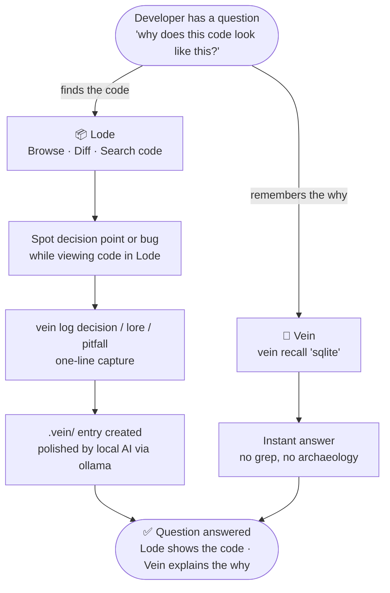
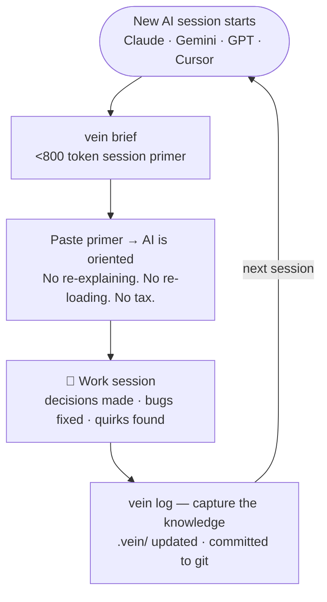

# Vein — Flowchart Diagrams
> 兩張流程圖：Lode+Vein 協作、Vein+AI session 循環。
> Mermaid 版（Jekyll 可直接 render）+ SVG embed 版（見 flowcharts.svg）。

---

## Flow 1 — Lode + Vein（Sunnywalker 協作）

---

## Flow 2 — Vein + Claude / Gemini（AI session 循環）

---

## SVG 版

見同目錄 `flowcharts.svg`，可直接 `` 或 `` 內嵌。

---

## 使用建議（網頁）

| 情境 | 用法 |
|------|------|
| Jekyll + mermaid plugin | 直接用上面的 code block |
| 靜態 HTML embed | `` |
| Dark mode 支援 | SVG 使用 CSS variable，跟隨 `prefers-color-scheme` |
| OG image / social | 截圖 SVG，export 為 1200×630 PNG |
