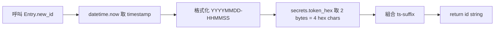
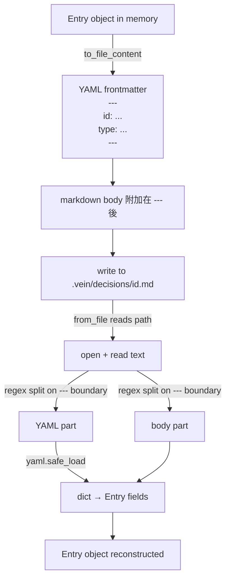
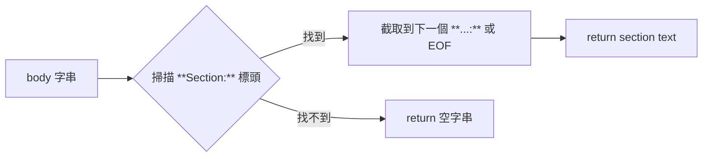

# test_models.py — Entry 資料模型測試

**測試對象：** `src/vein/core/models.py` → `Entry` dataclass  
**執行：** `pytest tests/test_models.py -q`  
**目前 case 數：** 11

---

## Entry 是什麼

`Entry` 是 vein 的核心資料單位，代表一筆 decision / lore / pitfall / reference。  
磁碟格式是一個 `.md` 檔，YAML frontmatter + markdown body：

```
---
id: 20260528-101259-78f1
type: decision
title: Use FTS+embed for recall
tags: [fts, embedding, search]
date: 2026-05-28T10:12:59+00:00
source: local
related: []
status: active
---
**Why:** hybrid search gives better recall than pure BM25 ...

**Trade-off:** requires ollama for embedding; fallback to keyword when offline
```

### Entry 欄位

| 欄位 | 型別 | 說明 |
|------|------|------|
| `id` | str | `YYYYMMDD-HHMMSS-<4hex>`，timestamp + random |
| `type` | `"decision"｜"lore"｜"pitfall"｜"reference"` | 分類 |
| `title` | str | ≤10 words，imperative form |
| `tags` | list[str] | 3–5 snake_case tags |
| `date` | datetime | capture time，UTC |
| `source` | str | `"local"` / `"import:decisions.md"` / ... |
| `related` | list[str] | 關聯 entry id 清單 |
| `status` | `"active"｜"superseded"｜"archived"` | 狀態 |
| `superseded_by` | str | 被哪筆取代（status=superseded 時用） |
| `body` | str | markdown body，結構依 type 而異 |

---

## 測試覆蓋範圍

```
test_models.py
│
├── ID 生成（Entry.new_id）
│   ├── test_new_id_format        — 格式符合 YYYYMMDD-HHMMSS-HHHH
│   └── test_new_id_unique        — 連續 20 次 id 全不重複
│
├── 序列化 roundtrip（to_file_content ↔ from_file）
│   ├── test_roundtrip_basic      — 基本欄位完整還原
│   ├── test_roundtrip_all_types  — 四種 type 都能正確解析
│   ├── test_roundtrip_empty_tags — tags=[] 不產生 YAML 錯誤
│   ├── test_roundtrip_unicode_title — 中英混合標題
│   ├── test_roundtrip_related    — related list 還原正確
│   └── test_roundtrip_status_superseded — status + superseded_by 一起
│
├── body_section 解析
│   ├── test_body_section_found   — **Why:** 段落可被提取
│   └── test_body_section_missing — 不存在的段落回傳 ""
│
└── date_str 格式
    └── test_date_str_format      — 固定時間輸出 "2026-05-28" 前綴
```

---

## Flowchart

### `Entry.new_id()` 生成流程



### `to_file_content` → `from_file` Roundtrip



### body_section 提取邏輯



---

## 假數據 Helper

```python
def _make_entry(**kwargs) -> Entry:
    """產生一個有合理預設值的 Entry，可 override 任意欄位。"""
    defaults = dict(
        id=Entry.new_id(),
        type="decision",
        title="Use callback not polling",
        tags=["dma", "hal", "systemc"],
        body="**Why:** event-driven model\n\n**Trade-off:** ISR discipline needed",
    )
    defaults.update(kwargs)
    return Entry(**defaults)
```

用法：

```python
# 只改 type
e = _make_entry(type="pitfall")

# 改 title + 清空 tags
e = _make_entry(title="UART baud mismatch", tags=[])

# 加 related
e = _make_entry(related=["20260101-000000-abcd"])
```

---

## 新增測試的規則

新增 `Entry` 欄位或改序列化格式時，對應需補的 case：

1. `test_roundtrip_<new_field>` — 新欄位 write → read 後值正確
2. 若新欄位有 default，補 `test_roundtrip_<new_field>_default` — 空值不崩潰
3. 若新欄位影響 `body_section` 解析，補 `test_body_section_<scenario>`
