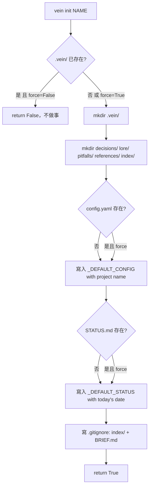
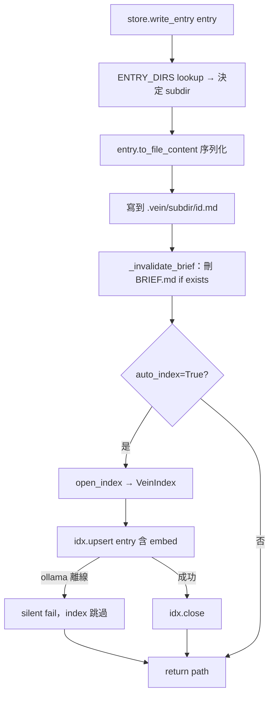
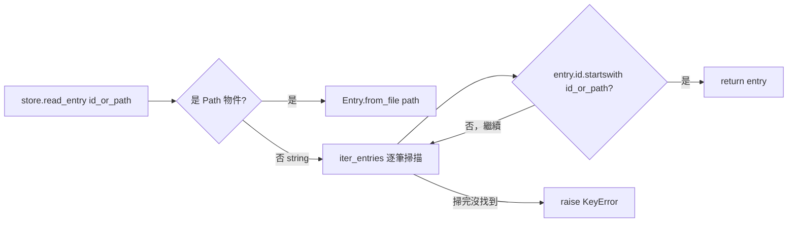
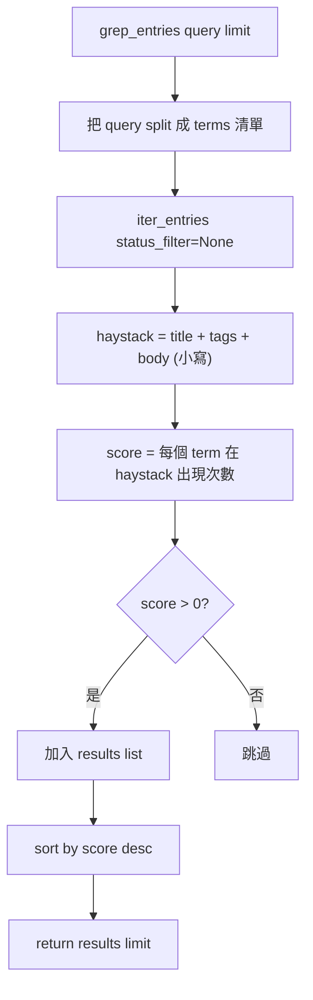
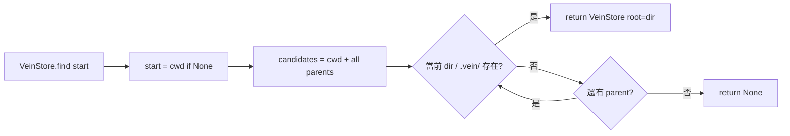

# test_store.py — VeinStore I/O 測試

**測試對象：** `src/vein/core/store.py` → `VeinStore` class  
**執行：** `pytest tests/test_store.py -q`  
**目前 case 數：** 19

---

## VeinStore 是什麼

`VeinStore` 封裝所有對 `.vein/` 目錄的讀寫操作，類似 git 的 object store。

```
project/
  .vein/
    config.yaml        ← load_config()
    STATUS.md          ← 手動維護
    BRIEF.md           ← brief cache（TTL 1h，寫入 entry 時自動失效）
    decisions/         ← write_entry / iter_entries
    lore/
    pitfalls/
    references/
    index/
      vein.db          ← open_index() → VeinIndex（SQLite）
```

### 主要 API

| 方法 | 說明 |
|------|------|
| `VeinStore.find(start)` | 從 start（預設 cwd）往上找 `.vein/` |
| `VeinStore.require(start)` | 找不到就 raise RuntimeError |
| `store.init(name, force)` | 建立 `.vein/` 結構 |
| `store.write_entry(entry, auto_index)` | 寫檔 + 失效 BRIEF + upsert index |
| `store.read_entry(id_or_path)` | 依 id prefix 或 Path 讀回 Entry |
| `store.list_entries(type, status, limit)` | 列出 entries，newest first |
| `store.iter_entries(type, status)` | generator 版本 |
| `store.stats()` | 各 type 計數 dict |
| `store.grep_entries(query, limit)` | 關鍵字搜尋，回傳 `[(Entry, score)]` |
| `store.open_index()` | 開啟 SQLite index，回傳 VeinIndex |
| `store.read_brief()` | 讀 BRIEF.md（含 TTL 檢查） |
| `store.write_brief(content)` | 寫 BRIEF.md |

---

## 測試覆蓋範圍

```
test_store.py
│
├── init
│   ├── test_init_creates_structure    — 所有子目錄 + 檔案都建立
│   ├── test_init_idempotent           — 重複 init 回傳 False，不覆寫
│   └── test_init_force                — force=True 強制重建
│
├── write / read
│   ├── test_write_read_roundtrip      — 寫入後讀回欄位一致
│   ├── test_write_all_types           — 四種 type 分別存入正確子目錄
│   └── test_read_by_prefix            — 用 id 前 8 碼就能讀回
│
├── error handling
│   ├── test_read_not_found_raises     — 不存在的 id → KeyError
│   └── test_require_raises_when_missing — 無 .vein/ → RuntimeError
│
├── list / iter
│   ├── test_list_entries_type_filter  — type_filter="decision" 只回傳 decision
│   ├── test_list_entries_status_filter — status_filter 正確隔離
│   └── test_list_entries_limit        — limit=3 截斷
│
├── stats
│   └── test_stats                     — 計數與實際檔案數一致
│
├── brief invalidation
│   └── test_brief_invalidated_on_write — write_entry 後 BRIEF.md 消失
│
├── grep_entries
│   ├── test_grep_returns_matches      — 標題 match 回傳正確 entry
│   ├── test_grep_case_insensitive     — 大小寫不分
│   └── test_grep_no_match             — 無 match 回傳 []
│
├── open_index
│   └── test_open_index_creates_db     — SQLite 檔案被建立
│
└── find / require
    ├── test_find_from_subdir          — 從子目錄往上找到 .vein/
    ├── test_find_returns_none_when_missing — 不存在回傳 None
    └── test_require_raises_when_missing    — raises RuntimeError with hint
```

---

## Flowchart

### VeinStore 初始化流程（`vein init`）



### `write_entry` 完整流程



### `read_entry` 查找流程



### `grep_entries` 關鍵字搜尋



### `find` 目錄搜尋（git 風格）



---

## Fixture 說明

```python
@pytest.fixture
def store(tmp_path) -> VeinStore:
    """每個 test 拿到一個全新的 tmp 目錄 + 已 init 的 VeinStore。
    tmp_path 是 pytest built-in，每次 test 都不同路徑，互不干擾。
    """
    s = VeinStore(tmp_path)
    s.init(name="test-project")
    return s
```

### 假數據 Helper

```python
def _entry(type_="decision", title="Test entry", **kwargs) -> Entry:
    """快速產生測試 Entry。
    注意：預設 body 已設好，不要再傳 body= 參數（會 multiple values error）。
    """
    return Entry(
        id=Entry.new_id(),
        type=type_,
        title=title,
        tags=["test"],
        body="**Why:** testing\n\n**Trade-off:** none",
        **kwargs,
    )
```

批量假數據：

```python
entries = [_entry(title=f"entry {i}") for i in range(10)]
for e in entries:
    store.write_entry(e, auto_index=False)
```

---

## 新增測試的規則

| 新增功能 | 對應補充 test |
|----------|---------------|
| VeinStore 新方法 | `test_<method_name>_<scenario>` |
| 新 entry type | `test_write_all_types` 加入新 type |
| config.yaml 新欄位 | `test_load_config_<field>` |
| brief TTL 邏輯 | `test_brief_ttl_expired` / `test_brief_ttl_fresh` |
| 新 status 值 | `test_list_entries_status_filter` 加入新值 |
